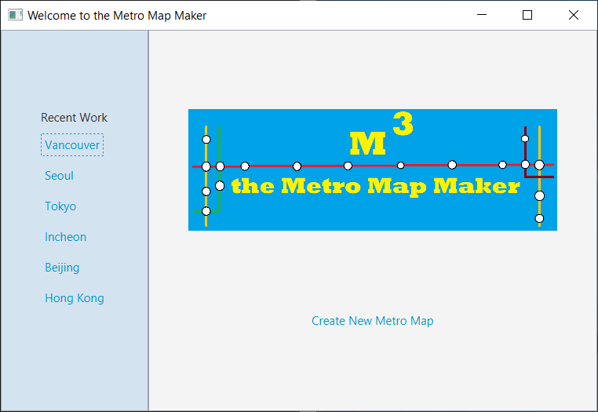
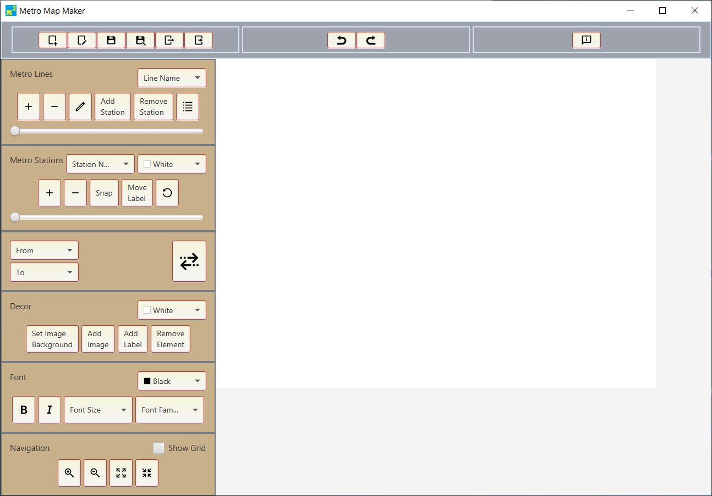
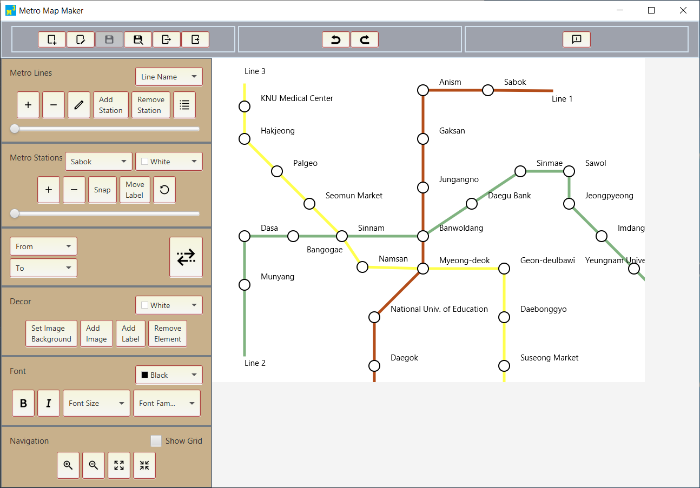
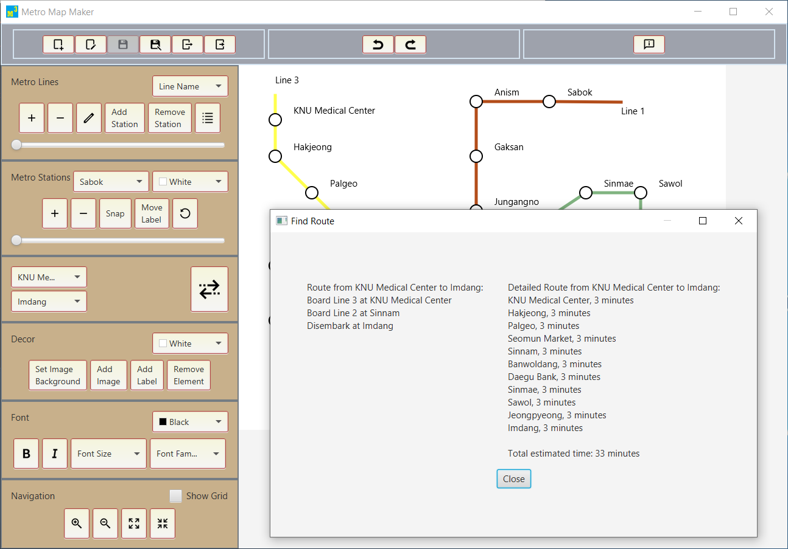

# Metro Map Maker

Metro Map Maker is a JavaFX Application that lets the user to draw their metro systems map and then find minimum transfer route. Undo and redo edit are implemented with the help of the transaction system. It can also save and load work and export to the specified webpage (made by Professor Richard McKenna) written in HTML, CSS and JavaScript.

  
  
  
  

## Getting Started

This project comprises source codes, supplementary documents and distributable JAR file to execute the program.

### Supplementary Documents

Supplementary Documents are in the doc folder. Software Requirements Specification (written by Professor McKenna), Software Design Description, Program Screenshots and Example work of the metro map are included.

### Distributable & Executable JAR File

Distributable and executable JAR file is in the dist folder as "MetroMapMaker.zip". Unzip it check if data, images, lib, work directories and MetroMapMaker.jar are all there. Run MetroMapMaker.jar with a Java Runtime Environment 8.

### Checking Source Codes

Source codes are in the app folder. MetroMapMaker is based on DesktopJavaFramework, jTPS(Java Transaction Processing System) and PropertiesManager. This project is written with NetBeans IDE. To view the source code with NetBeans, simply put the app folder to your machine's NetBeansProjects directory or elsewhere. Go to File -> Open Project and then open all four projects(files). To run the program, right-click and run MetroMapMaker from Projects or run mmmApp.java. 

## Author

**Myungsuk Moon** - [msukmoon](https://github.com/msukmoon) - jaymoon9876@gmail.com
* Professor Richard McKenna(richard@cs.stonybrook.edu) of Stony Brook University provided the Software Requirements Specification, DesktopJavaFramework, jTPS(Java Transaction Processing System) and PropertiesManager.
